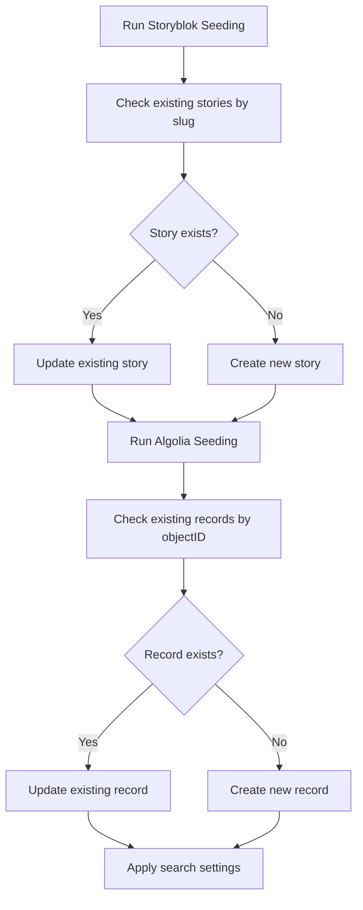
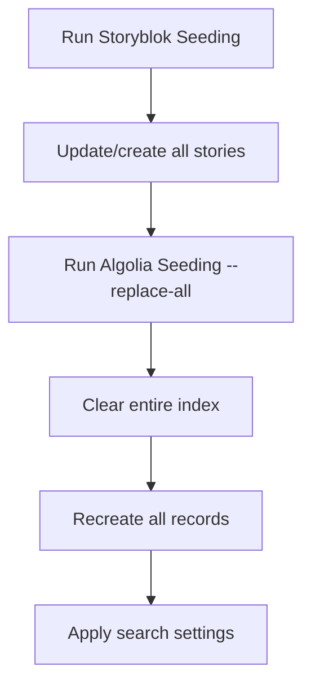

# Improved Seeding System

This document describes the enhanced seeding system with upsert logic and compatibility improvements.

## Key Improvements

### No More Duplicates
- **Storyblok**: Updates existing stories by slug, creates new ones if not found
- **Algolia**: Updates existing records by objectID, creates new ones if not found
- **Safe re-runs**: You can run seeding scripts multiple times without creating duplicates

### Data Structure Compatibility
- **Fixed field mapping**: Algolia records now include both `description` and `summary` fields
- **Search component compatibility**: Records work seamlessly with React InstantSearch
- **Metadata alignment**: Tags and metadata are properly structured for search

### Flexible Seeding Modes
- **Upsert mode** (default): Updates existing data, preserves what's already there
- **Replace mode**: Clears existing data and rebuilds from scratch
- **Configurable**: Choose the appropriate mode for your use case

## Quick Usage

### **Recommended Workflow**
```bash
# 1. Seed Storyblok content (creates/updates stories)
npm run seed:storyblok

# 2. Sync to Algolia search index (upsert mode)
npm run seed:algolia

# 3. Configure search settings and synonyms
npm run algolia:config
```

### **One-Command Setup**
```bash
# Complete setup with upsert logic
npm run seed:all && npm run algolia:config
```

### **Fresh Start (if needed)**
```bash
# Complete rebuild (clears existing data)
npm run seed:all:replace && npm run algolia:config
```

## Available Commands

| Command | Description | Duplicate Safety |
|---------|-------------|------------------|
| `npm run seed:storyblok` | Create/update Storyblok stories | Upsert by slug |
| `npm run seed:algolia` | Sync to Algolia (upsert mode) | Upsert by objectID |
| `npm run seed:algolia:replace` | Rebuild Algolia index | ⚠️ Clears existing data |
| `npm run seed:all` | Complete upsert workflow | Safe re-runs |
| `npm run seed:all:replace` | Complete rebuild workflow | ⚠️ Clears existing data |
| `npm run algolia:config` | Apply search settings & synonyms | Idempotent |

## Technical Details

### **Storyblok Upsert Logic**
```python
def upsert_story(name, slug, content, ...):
    existing = find_story_by_slug(slug)
    if existing:
        # Update existing story
        api("PUT", f"/stories/{existing['id']}", json=payload)
    else:
        # Create new story
        api("POST", "/stories", json=payload)
```

### **Algolia Upsert Logic**
```javascript
async upsertObjects(objects) {
    // Get existing records
    const existingObjects = await this.getExistingObjects();
    const existingIds = new Set(existingObjects.map(obj => obj.objectID));

    // Classify as updates vs creates
    objects.forEach(obj => {
        if (existingIds.has(obj.objectID)) {
            toUpdate.push(obj);
        } else {
            toCreate.push(obj);
        }
    });

    // Algolia automatically handles updates/creates
    await this.client.saveObjects({ objects });
}
```

### **Data Structure Mapping**

| Storyblok Component | Algolia Record | Search Component |
|---------------------|----------------|------------------|
| `component.name` | `title`, `name` | `hit.title` |
| `component.description` | `description`, `summary` | `hit.summary` |
| `meta.tags` | `tags`, `metadata` | `hit.metadata` |
| `component.image.filename` | `image` | `hit.image` |
| `story.slug` | `slug` | - |
| `story.id` | `objectID: story_${id}` | `hit.objectID` |

## Search Compatibility

The improved system ensures perfect compatibility with your React InstantSearch component:

```jsx
// Your search component expects these fields
interface Hit {
  objectID: string;    // Generated as `story_${storyId}`
  title: string;       // From component.name or component.title
  summary: string;     // Truncated from description
  type?: string;       // From component type (cafe/event)
  image?: string;      // From component.image.filename
  metadata?: string[]; // From parsed tags
}
```

## Seeding Process Flow

### **Upsert Mode (Recommended)**


### **Replace Mode**


## Important Notes

### **When to Use Each Mode**

**Use Upsert Mode (default) when:**
- Adding new content to existing data
- Updating specific stories or records
- Running regular content updates
- You want to preserve existing data

**Use Replace Mode when:**
- Major schema changes
- Starting fresh after testing
- Data corruption issues
- Complete content restructuring

### **Environment Variables Required**
```bash
# Storyblok
SB_SPACE_ID=your_space_id
SB_PAT=your_personal_access_token

# Algolia
ALGOLIA_APPLICATION_ID=your_app_id
ALGOLIA_WRITE_API_KEY=your_write_key
ALGOLIA_INDEX_NAME=brewbook
NEXT_PUBLIC_ALGOLIA_APPLICATION_ID=your_app_id
NEXT_PUBLIC_ALGOLIA_API_KEY=your_search_key
NEXT_PUBLIC_ALGOLIA_INDEX_NAME=brewbook
```

## Testing the Setup

### **Verify No Duplicates**
```bash
# Run seeding twice - should show updates, not duplicates
npm run seed:all
npm run seed:all

# Check logs for "Objects to update" vs "Objects to create"
```

### **Test Search Functionality**
```bash
# Apply search configuration
npm run algolia:config

# Test search features
npm run algolia:test
```

### **Verify Data Structure**
```bash
# Check Algolia dashboard or use search API to verify fields:
# - title, summary, type, image, metadata are present
# - objectID follows "story_${id}" pattern
```

## Benefits

1. **Safe Operations**: No more accidental data loss from duplicate creation
2. **Fast Updates**: Only changed content gets updated
3. **Consistent Data**: Perfect alignment between Storyblok and search
4. **Developer Friendly**: Clear commands and comprehensive logging
5. **Production Ready**: Proper error handling and validation

Run `npm run seed:all && npm run algolia:config` to get started with the improved seeding system!